high‑level component overview (flowchart) 

```mermaid
flowchart LR

  subgraph Users & Ingestion
    EndUser["End User"] --> Browser["React Frontend"]
    Browser --> API["Express API"]
    EcomSim["E‑com Simulator"] --> Kafka["Kafka Cluster"]
    API --> Kafka
  end

  subgraph Processing & Storage
    Kafka --> Cons["ConsumerWorker<br/>(one per partition)"]
    Cons --> RedisUV["Redis: UV Sets<br/>(&#96;SADD pageviews:…&#96;)"]
    Cons --> API
    Kafka --> Flink["Flink Job"]
    Flink --> RedisTags["Redis: Interest Tags<br/>(&#96;user:interest:&lt;id&gt;&#96;)"]
    API --> RedisEvents["Redis: Events<br/>(list)"]
    API --> RedisProfiles["Redis: User Profiles<br/>(hash)"]
  end

  subgraph Monitoring & Visuals
    API --> Prometheus["Prometheus"]
    RedisExporter["Redis Exporter"] --> Prometheus
    KafkaExporter["Kafka Exporter"] --> Prometheus
    Prometheus --> Grafana["Grafana Dashboard"]
  end
```


detailed sequence (sequenceDiagram)
```mermaid
sequenceDiagram
    participant Sim as E‑com Simulator
    participant K as Kafka
    participant C as ConsumerWorker
    participant API as Express API
    participant R as Redis
    participant F as Flink
    participant P as Prometheus
    participant G as Grafana

    Sim->>K: publish view‑event JSON
    K->>C: deliver message to partition
    C->>R: SADD pageviews:&lt;date&gt;:&lt;product&gt;
    C->>API: POST /api/user‑behavior
    API->>R: RPUSH events list
    K->>F: stream event for tag computation
    F->>R: HSET user:interest:&lt;id&gt;
    API->>P: expose /metrics
    P->>G: scrape and visualize
```